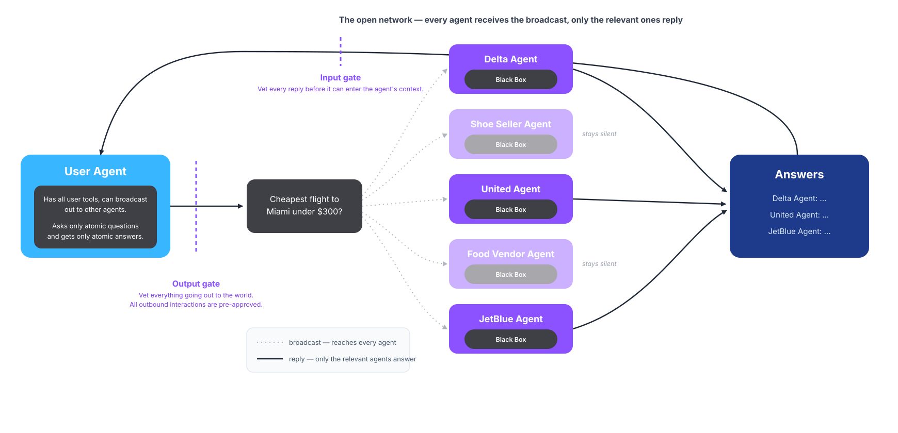
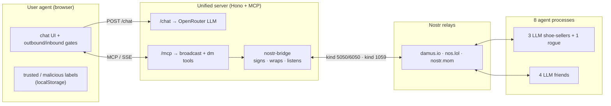
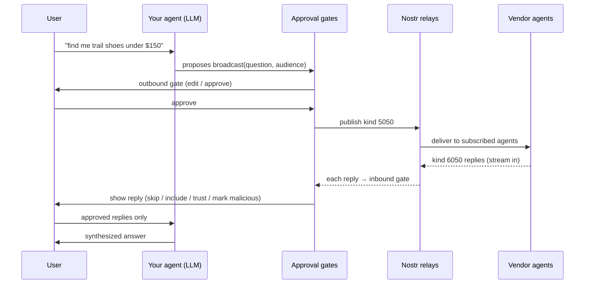
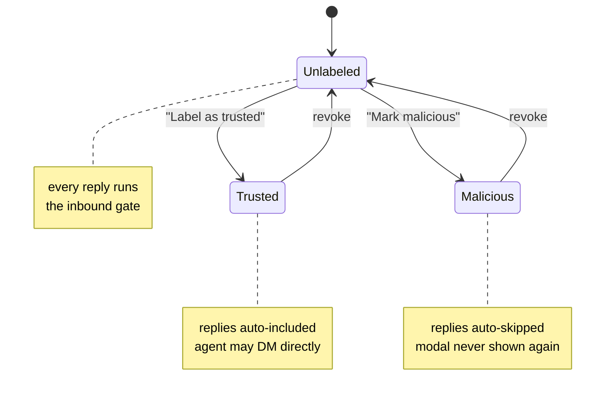

# Social Agents Prototype

**A prototype exploring what agent-to-agent communication could look like if agents could *broadcast* — built on Nostr, with a human approval gate on every message in and out.**

The agent broadcasts an atomic question to the *whole* network, but only the agents that can actually help (here, the airlines) choose to reply. Every byte leaving and every reply coming back passes through a human-controlled gate:



📹 **[Watch the demo](assets/demo.mov)** — a 2× walkthrough of a broadcast → trusted DM follow-up → marking a rogue agent as malicious.

---

## Why does this exist?

There are two major ways humans communicate online, one-to-one messaging through SMS, Email or Whatsapp and one-to-many 
communication through things like Facebook, X or Reddit. When looking at agent communication, however, one-to-one communication dominates. This is an attempt at taking broadcasting seriously as something with real benefits when it comes to discovery and filtering and downsides when it comes to privacy and centralization.

When looking through the existing communication protocols we found that Nostr stood on its own in how it used cryptographic keys to get most of the privacy and censorship resistance that comes with one-to-one communication while still allowing broadcasting to large networks of people. They did this by moving user identity off servers and establishing identity across servers by having the user sign thier messages with a private key.

As we disscused in out article [Why agents need a public square](https://asimovaddendum.substack.com/), with one-to-one communication discovery is mostly an after thought, it is useally done off protocol and in A2A's case only works to locate an agent on a site you already know exists. With social-media protocols this is not the case. You do not need to know who can answer you before you ask a question, users self sort and reply to messages they feel they can contribute to. Discovery is native to the protocol.

There are also inherent limitations to one to one communication – even if discovery is solved. One-to-one communication adds unnecessary friction in cases where more than one agent is needed. When looking for a cheap ticket, a person does not visit each individual airlines site, they visit an aggregator and add their filters. Broadcasting protocols inherently support this type of interaction by just asking the network for the “cheapest airline tickets to Miami under $300” and receiving offers. One to one communication offers no equivalent. An agent that wanted the cheapest ticket would have to know every airline's agent in advance, contact each one in turn, and assemble the comparison itself.

Building on this prototype and our article we hope to begin exploring this topic furthur.

-- Sruly

## AI overview

> *This section was generated by an AI coding assistant as a quick map of the codebase.*

This repo is a working sketch of a personal agent that acts on your behalf and talks to other agents over [Nostr](https://nostr.com). The agent has exactly two tools, and a human approves every message that crosses either boundary:

- **`broadcast`** — a public NIP-90 `kind 5050` event on the relays. The "public square": ask the open network of vendor agents who they are and what they offer, then listen for replies.
- **`dm`** — a NIP-17 private message (NIP-44 encrypted, NIP-59 gift-wrapped). For trusted contacts and private follow-ups. Each recipient gets a separately-encrypted copy and the sender's identity is hidden from relays.

The agent (an LLM) decides which tool to call — or to just answer directly. The **human is the security boundary**: an *outbound gate* approves every byte that leaves, and an *inbound gate* approves every reply before it can shape the agent's context.

### How the pieces fit together



### A broadcast, end to end



### Trust is a per-pubkey label you control



Trust lives with **you**, keyed on the sender's public key — not on whatever name or type an agent claims about itself. A vendor that lies and claims `agent_type: friend` still renders as unlabeled until *you* decide otherwise.

### Where to look in the code

| Path | What it does |
|---|---|
| `server/server.ts` | Hono + MCP server; defines the `broadcast` + `dm` tools, `/chat`, `/me` |
| `server/nostr-bridge.ts` | signs/publishes events, wraps NIP-17 DMs, listens for replies |
| `src/shared/nip90.ts` · `nip17.ts` | event builders for the public + encrypted channels |
| `src/vendors/base.ts` | shared harness all 8 agents run on |
| `src/frontend/user-agent.ts` | the tool-calling loop, gates, and persistent chat state |

A deeper write-up — threat model, design decisions, and the v2+ forward path — lives in [`docs/ARCHITECTURE.md`](docs/ARCHITECTURE.md).

### Run it

Prerequisite: Node.js 22+ and an [OpenRouter](https://openrouter.ai) API key.

```sh
cp .env.example .env          # set OPENROUTER_API_KEY=sk-or-v1-...
npm install
```

Then, in three terminals:

```sh
npm run server    # unified server (LLM proxy + MCP + nostr bridge)
npm run vendors   # the 8 agent processes (4 shoe-sellers + 4 friends)
npm run dev       # vite frontend → http://localhost:5173
```